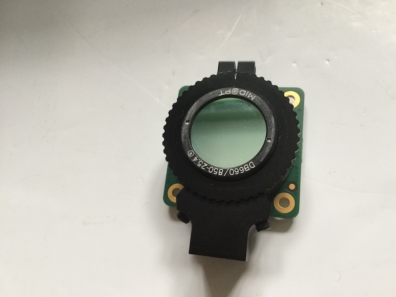
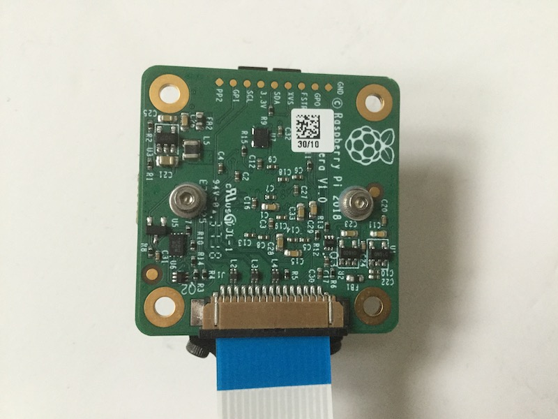

## Kit Assembly

In this step we are going to build a real Astro Pi using the official Astro Pi kit you received from ESA. We understand that building your Astro Pi can be intimidating, which is why we have created the handy guide & checklist below for you to follow!

--- collapse ---
---
title: What's in the box?
---
It may be small but your kit box really packs a punch! Your official Astro Pi kit includes:
+ A Raspberry Pi 4
+ A Sense HAT
+ A power cable
+ A 16GB SD card

If your experiment needs it, you may also have any of the following in your box:
+ A Camera Module
+ A passive infrared (PIR) motion sensor
+ A Coral TPU dongle

If you want to, you can [make a 3D-printed flight case](https://projects.raspberrypi.org/en/projects/astro-pi-flight-case-mk2){:target="_blank"}, and use this to even more closely simulate the ISS environment for more realistic testing. However, you don't need one to take part in Mission Space Lab. 

--- /collapse ---

### Assembling the hardware

We are going to build the Astro Pi together! We will start by connecting the Camera "ribbon" cable to the Raspberry Pi, if you were supplied with a camera. Then, we will put on the Sense Hat. Finally, we'll finish by connecting the camera module and the PIR sensor, if you have them.

--- task ---
Unpack everything from your kit and make a note of whether your box includes the camera module, a Coral TPU dongle, or a PIR motion sensor.
--- /task ---

--- collapse ---
---
title: Optional step: my box contains a camera
---

--- task ---
Insert the camera ribbon cable into the CSI (Camera Serial Interface) socket on the Raspberry pi.  

[[[rpi-picamera-connect-camera]]]

--- /task ---

--- /collapse ---

We are going to assemble the Sense Hat, which will look like this:

--- task ---
Take the black hexagonal spacer columns from the small bag that comes with the Sense HAT. Use the accompanying screws to connect them to the bottom of the Raspberry Pi 4.

--- /task ---

--- task ---
Take the Sense HAT and remove the short header if it is attached.

--- /task ---

--- task ---
Line up the tall header with the corresponding holes on the Sense HAT.  

--- /task ---

--- task ---
Push the header all the way through. Make sure none of the pins are obstructed and that they are lined up correctly so that they do not become bent.  

--- /task ---

--- collapse ---
---
title: My box contains a camera
---

--- task ---
Feed the camera cable through the slot on the Sense HAT and then sit the Sense HAT onto the Raspberry Pi device. Make sure that all 40 GPIO pins line up with the corresponding holes in the tall header.   

<iframe width="560" height="315" src="https://www.youtube.com/embed/VzYGDq0D1mw" frameborder="0" allow="accelerometer; autoplay; encrypted-media; gyroscope; picture-in-picture" allowfullscreen></iframe>

--- /task ---

--- /collapse ---

--- task ---
Use the four remaining black screws to secure the Sense HAT stack to the spacers. 

--- /task ---

--- collapse ---
---
title: My box contains a PIR sensor
---

--- task ---
Now take the PIR and remove the foam pin protector block. 

--- /task ---

--- task ---
Connect three wires to the pins on the PIR. Note the labels on the back of the PIR circut board which indicate the use of each pin: 

- The GND needs to be connected to corresponding ground pin on the Raspberry Pi
- The VCC needs to be connected to a 3V3 pin on the Raspberry Pi
- The OUT should be connected to [GPIO pin 12](https://projects.raspberrypi.org/en/projects/physical-computing/1) on the Raspberry Pi

--- /task ---

--- task ---
Connect the wires from the PIR to the appropriate GPIO pins on the Raspberry Pi. You can use [the diagrams here](https://www.raspberrypi.org/documentation/usage/gpio/) to help you make sure that you connect the wires to the correct pins. 

--- /task ---

--- /collapse ---

--- collapse ---
---
title: My box contains a Coral TPU
---

-- task ---
Insert the USB-C cable into the Coral dongle and the other end
into any USB-3 port §b
--- /task ---

--- /collapse ---

#### Converting a camera for IR-sensitive Life on Earth experiments

The high-quality camera sensor can detect infrared (IR) light. However, the sensor housing contains an IR filter, which is used to greatly reduce the camera’s sensitivity to IR light.  This is so that the images captured by the high-quality camera sensor look the same as what we see with our eyes (which are not sensitive to IR light). 

If your Life on Earth experiment requires an IR-sensitive camera (like the one on Astro Pi IR), then you will need to convert the high-quality camera sensor you received in your kit by removing the IR filter. If you are programming a Life in Space experiment, or your Life on Earth experiment requires photos to be taken in the visible light spectrum only, then you should not convert your high-quality camera sensor. Please skip to the final assembly steps below. 

--- collapse ---
---
title: Converting a camera for IR-sensitive experiments
---

**Note**: This process cannot be reversed or undone once completed.

--- task ---

Please ensure that you need the IR-sensitive camera before following the [instructions here](https://www.raspberrypi.org/documentation/accessories/camera.html#raspberry-pi-hq-camera-filter-removal).
--- /task ---

Now you can add the DB660/850-25.4 red/NIR dual band pass filter. This been designed primarily for NDVI (Normalized Difference Vegetation Index) imaging applications. By adding it to the High Quality Camera sensor, only reflected red light (660nm) and reflected near-infrared light (850nm) will be captured by the sensor.  See our [NDVI project](https://projects.raspberrypi.org/en/projects/astropi-ndvi) for more information. 

--- task ---
 
Make sure the back focus ring is screwed all the way in. 

--- /task ---

--- task ---
 
Unscrew the high-quality camera sensor lens cap and the C/CS adapter. 

--- /task ---

--- task ---
 
Take the filter and sit it onto the hole in the centre of the high-quality camera sensor. 

--- /task ---

--- task ---
 
Gently start turning the filter clockwise using just your fingers, so that the filter screws down into the high-quality camera sensor. Take care not to touch the glass part of the lens and leave greasy fingerprints!

--- /task ---

--- task ---
 
Take the tool provided with the filter and line up the two knobbly bits at each end with the corresponding dimples in the filter. If you have a 3D printer, you might like to print a handle for the tool to make it easier to grip. One of these handles has been printed and sent to the ISS for the astronauts to use when completing the task — but it isn't required. 

--- /task ---

--- task ---
 
Continue gently turning the filter using the tool. Take care not to touch the glass part of the lens with the tool — it will scratch it!

--- /task ---

--- task ---
 
You should start to feel increasing resistance as the filter gets lower. After about nine full turns, the filter should be as low as it can go and you won't be able to turn it any further. Be careful not to over-tighten. 

--- /task ---
--- /collapse ---

#### Final assembly steps 

--- task ---
Insert the other end of the camera cable into the CSI socket on the high-quality camera sensor. 

--- /task ---

--- task ---
Remove the cap from the high-quality camera sensor. 

--- /task ---

--- task ---
Remove the C/CS adapter ring from the high-quality camera sensor. 

--- /task ---

--- task ---
Remove the caps from the end of the 6mm lens and screw the lens onto the high-quality camera sensor. 

--- /task ---

**Note**: The camera sensor in the ESA kit is the same high-quality camera as the one found in the new Astro Pis on the ISS. You can read the [documentation about the HQ camera](https://www.raspberrypi.org/documentation/hardware/camera/), and a lot of detailed technical information can also be found in [the relevant section of the PiCamera library documentation](https://picamera.readthedocs.io/en/latest/fov.html#camera-hardware).

You are now ready to switch the Astro Pi on! Click on the next page.

