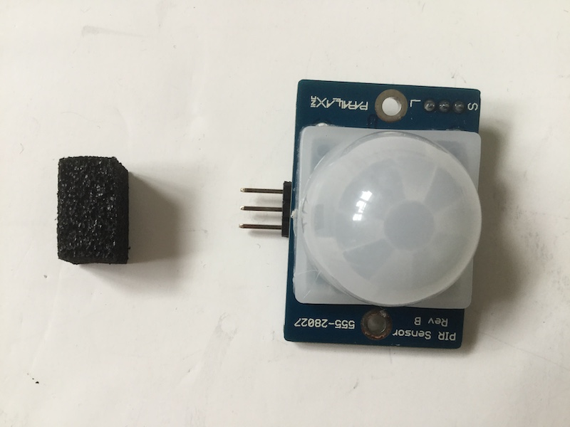
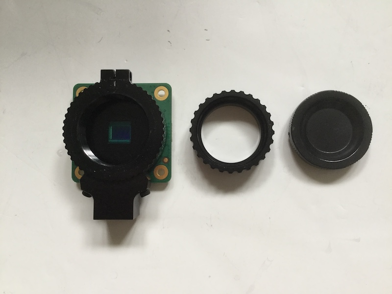
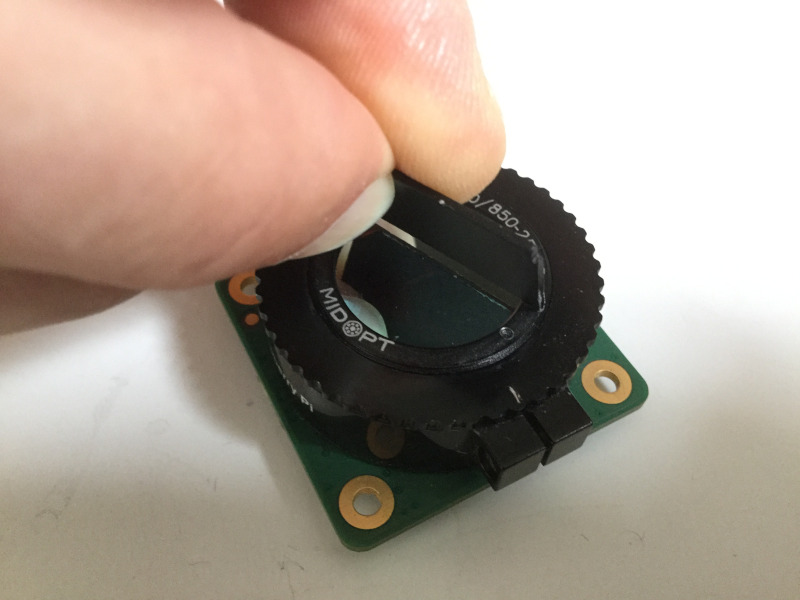
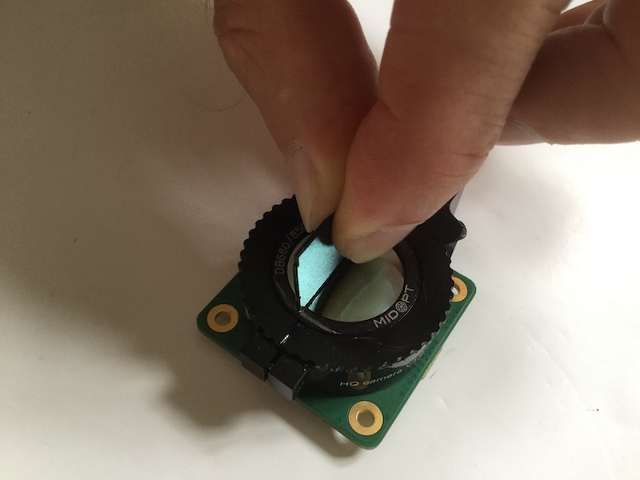
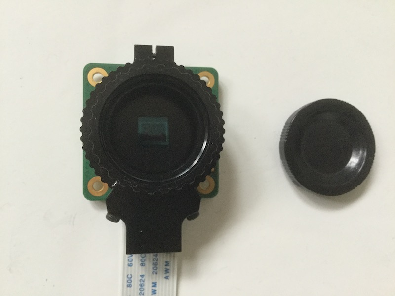
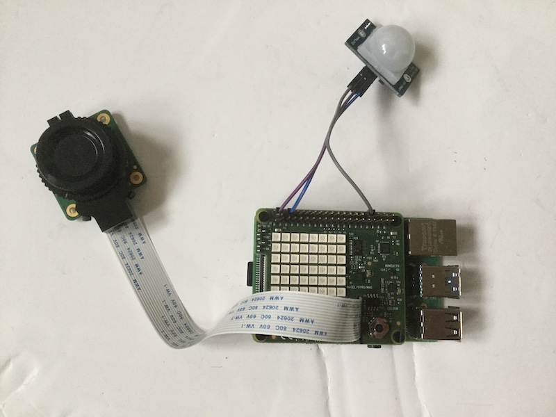
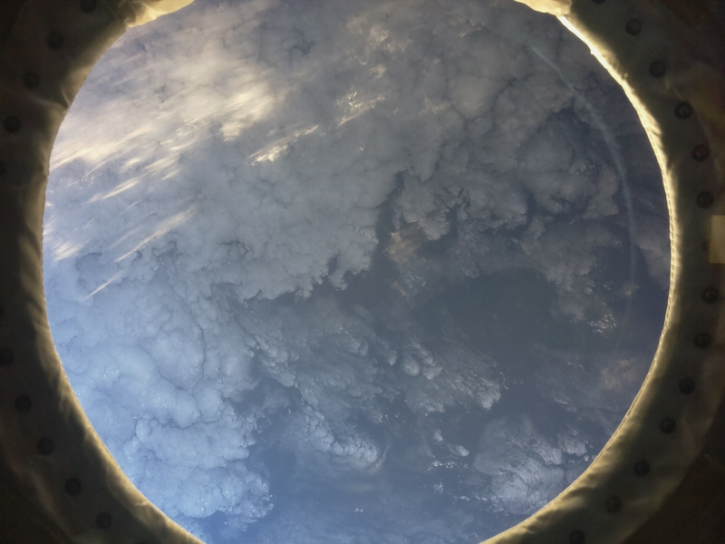

## Getting started

If you have received an official Astro Pi kit from ESA, you have everything you need to develop and test your Phase 2 program for Mission Space Lab (MSL). If you want to, you could even [create your own Astro Pi flight case](https://projects.raspberrypi.org/en/projects/astro-pi-flight-case), but don't worry, that's not essential, and completion of Mission Space Lab **does not** rely on having the flight case.

### Assembling the hardware

--- task ---
Unpack everything from your kit.

--- /task ---

--- task ---
Take the black hexagonal spacer columns from the small bag that comes with the SenseHAT. Use the accompanying screws to connect them to the bottom of the Raspberry Pi 4

--- /task ---

--- task ---
Insert the camera cable into the CSI socket on the Raspberry pi.  

[[[rpi-picamera-connect-camera]]]

--- /task ---

--- task ---
Take SenseHAT and remove the short header if its attached. 

--- /task ---

--- task ---
Line up the tall header with the corresponding holes on the SenseHAT.  

--- /task ---

--- task ---
Push the header all the way through. Make sure none of the pins are obstructed or not lined up correctly so that they become bent.  

--- /task ---

--- task ---
Feed the camera cable through the slot on the SenseHAt and then sit the SenseHAT onto the Raspberry Pi. Make sure that all 40 GPIO pins line up with the corresponding holes in the tall header.   

<iframe width="560" height="315" src="https://www.youtube.com/embed/VzYGDq0D1mw" frameborder="0" allow="accelerometer; autoplay; encrypted-media; gyroscope; picture-in-picture" allowfullscreen></iframe>

--- /task ---

--- task ---
Use the four remaining black screws to secure the SenseHAT stack to the spacers. 

--- /task ---

--- task ---
Now take the PIR and remove the foam pin protector block. 

--- /task ---

--- task ---
Connect three wires to the pins on the PIR. Note the labels on the back of the PIR PCB which indicate the use of each pin: 

GND - which needs to be connected to corresponding ground pin on the Raspberry Pi.
VCC - which needs to be connected to a 3v3 pin on the Raspberry Pi
OUT - which should be connected to GPIO pin 12 on the Raspberry Pi.

--- /task ---

--- task ---
Connect the wires from the PIR to the appropriate GPIO pins on the Raspberry Pi. You can use [the diagrams here](https://www.raspberrypi.org/documentation/usage/gpio/) to help you make sure that you connect the wires to the correct pins. 

--- /task ---

#### Converting a camera for IR sensitive Life on Earth experiments

The High Quality Camera sensor can detect Infra-Red (IR) light. However the sensor housing contains an IR filter, which is used to greatly reduce the camera’s sensitivity to infrared light.  This is so that the images captured by the High Quality Camera sensor look the same as what we see with our eyes (which are not sensitive to IR light). 

If your Life on Earth experiment requires an IR-sensitive camera (like the one on Astro Pi IR) then you will need to convert the High Quality Camera sensor you received in your kit by removing the IR cut filter. If you are programming a Life in Space experiment, or your Life on Earth experiment requires photos to be taken in the visible light spectrum only, then you should not convert your High Quality Camera sensor. Please skip to the Final Assembly Steps below. 

NOTE: This process cannot be reversed or undone once completed. 

--- task ---

Please ensure that you need the IR sensitive camera before following the [instructions here](https://www.raspberrypi.org/documentation/hardware/camera/hqcam_filter_removal.md)
--- /task ---

Take the DB660/850-25.4 red dual band pass filter and install it into the High Quality Camera sensor. 

--- task ---
 
Make sure the back focus ring is screwed all the way in. 

--- /task ---

--- task ---
 
Unscrew the High Quality Camera sensor lens cap and the C/CS adapter. 

--- /task ---

--- task ---
 
Take the filter and sit it onto the hole in the centre of the High Quality Camera sensor. 

--- /task ---

--- task ---
 
Gently start turning the filter clockwise using just your fingers, so that the filter screws down into the High Quality Camera sensor. Take care not to touch the glass part of the lens and leave greasy fingerprints!

--- /task ---

--- task ---
 
Take the tool provided with the filter and line up the two knobbly bits at each end with the corresponding dimples in the filter. If you have a 3D printer you might like to print a handle for the tool to make it easier to grip. One of these handles has been printed and sent to the ISS for the astronauts to use when completing the task - but it isn't required. 

--- /task ---

--- task ---
 
Gently continue turning the tool filter using the tool. Take care not to touch the glass part of the lens with the tool - it will scratch it!

--- /task ---

--- task ---
 
You should start to feel increasing resistance as the filter gets lower. After about 9 full turns, the filter should be as low as it can go and you won't be able to turn it any further. Be careful not to over-tighten. 

--- /task ---

--- task ---
 
Now you can screw the 6mm lens onto the High Quality Camera sensor. You do not need to re-attach the C/CS adapter ring as this is not required for this lens. 

--- /task ---
#### Final assembly steps 

--- task ---
Insert the other end of the camera cable into the CSI socket on the High Quality Camera sensor. 

--- /task ---

--- task ---
Remove the cap from the High Quality Camera sensor. 

--- /task ---

--- task ---
Remove the C/CS adapter ring from the High Quality Camera sensor. 

--- /task ---

--- task ---
Remove the caps from the end of the 6mm lens and screw the lens onto the High Quality camera sensor. 

--- /task ---

Your Astro Pi kit should now be complete. Insert your SD card, connect to a monitor, keyboard and mouse and finally plug in the USB-C power lead. For more details on using your Raspberry Pi, take a look at [this guide](https://projects.raspberrypi.org/en/projects/raspberry-pi-getting-started).

### Software and your Development Environment

After assembling your hardware, you will need to set up your development environment. If you received a kit from ESA, it will contain an SD card with the Desktop version of the Flight OS: a custom-built version of the Raspberry Pi Operating System that you will need.

The packages available in the Desktop Flight OS closely match the ones in the actual Flight OS, i.e. the operating system installed on the Astro Pi units on the ISS. However, the Flight OS is a "command-line only" environment that is not really convenient for developing programs and that is why the ESA kits provide a Desktop version that also includes a host of programming tools. Here is a [video tour](https://youtu.be/i57kwOiR7UM) of the 2020 version!

You will use this environment to _develop_ and _test_ the code for your experiment. Making sure that your program runs successfully in this environment is the best way to ensure that your experiment passes our testing procedure and can run on the Astro Pis on the ISS without any modifications.

Please, **do not perform any upgrades or install any additional packages or Python libraries** in this environment as these will not be available when your experiment runs.

--- collapse ---
---
title: Downloading Operating System images (optional)
---

If you want to create additional SD cards to use for Astro Pi, you can download the [Desktop Flight OS image file](http://downloads.raspberrypi.org/AstroPi_latest) used in the ESA kits. After downloading, you can use any software tool to write the image file to your own SD card. See [this guide](https://www.raspberrypi.org/documentation/installation/installing-images/) for instructions on how to do this. 

--- /collapse ---

If you've never used the Sense HAT before, [start with this short project](https://projects.raspberrypi.org/en/projects/getting-started-with-the-sense-hat/), and come back here once you're aware of basic Sense HAT uses.

If you've never used the Camera Module before, [start with this beginners' project](https://projects.raspberrypi.org/en/projects/getting-started-with-picamera/), and come back here once you've tried using the basic `picamera` Python library functions.

Note: The camera sensor in the ESA kit is the same High Quality camera as the one found in the new Astro Pis on the ISS. You can read the [documentation about the HQ camera](https://www.raspberrypi.org/documentation/hardware/camera/), with a lot of detailed technical information also to be found in [the relevant section of the PiCamera library documentation](https://picamera.readthedocs.io/en/release-1.13/fov.html#camera-hardware).

### Performance

The ESA kits for Astro Pi 2020/21 contain Raspberry Pi 4s with 4GB of memory (RAM). They are almost identical to the new Astro Pis on the ISS, except that they have 8GB of memory. This means there should really be very little difference in performance between the computer on which you develop and test your code and the computer where it actually runs, unless your experiment requires a lot of memory.

--- collapse ---
---
title: Sample data
---

The Desktop version of the Flight OS also contains a `Data` folder with sample data from a previous mission which can be used to help test and refine your code. 

#### Sensor readings

There is a comma-separated values (CSV) file with 3 hours worth of data from all of the Sense HAT sensors. The columns in this file are in this order:

Date
Time
Humidity
Temperature
Pressure
Pitch (as measured by gyroscope)
Roll (as measured by gyroscope)
Yaw (as measured by gyroscope)
Pitch (as measured by accelerometer)
Roll (as measured by accelerometer)
Yaw (as measured by accelerometer)
Raw accelerometer X value
Raw accelerometer Y value
Raw accelerometer Z value
Raw magnetometer X value
Raw magnetometer Y value
Raw magnetometer Z value
Latitude degrees
Latitude minutes
Latitude seconds
Longitude degrees
Longitude minutes
Longitude seconds

LibreOffice Calc is a spreadsheet program similar to Microsoft Excel and is installed on the Desktop Flight OS. You can use this to look at the data and plot charts.

#### Images

There is also a sequence of photos taken by the Mark I Astro Pi IR camera. The sequence starts at 'night', and so the first few photos are black.

Then, the window gradually appears as light starts to flood in.

By image 150, the Earth below becomes visible.

And eventually, the area surrounding the window cannot be seen at all.

You could use these images to train a machine learning algorithm to recognise different types of views. However, please note that there is no guarantee that the location, view, and orientation of the Astro Pi will be exactly the same when your program runs on the ISS. Therefore, your program should be flexible enough to adapt to any changes.

--- /collapse ---
