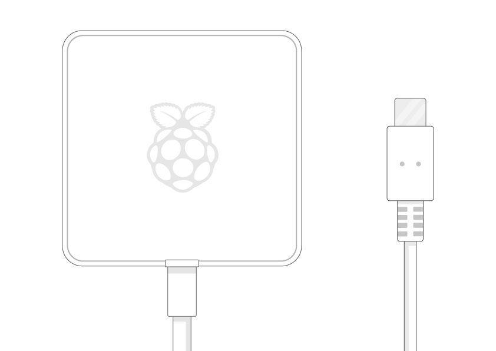
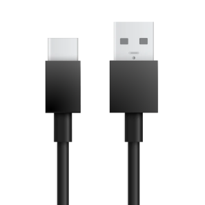
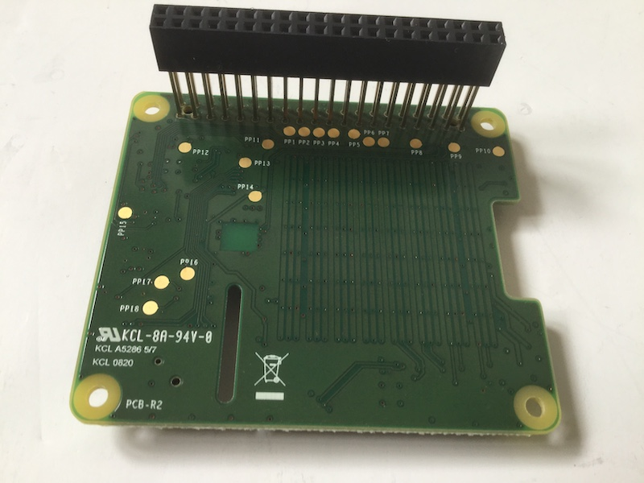
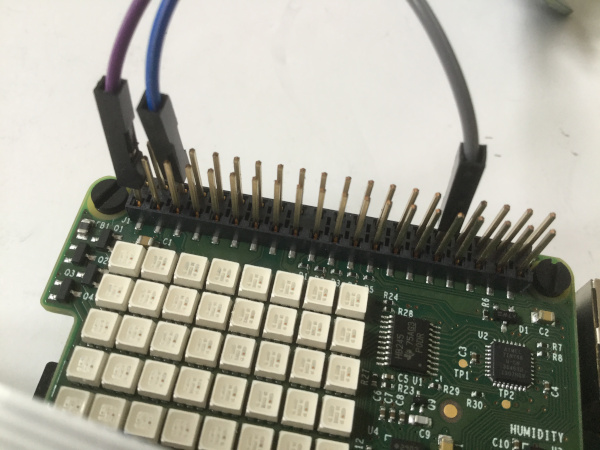
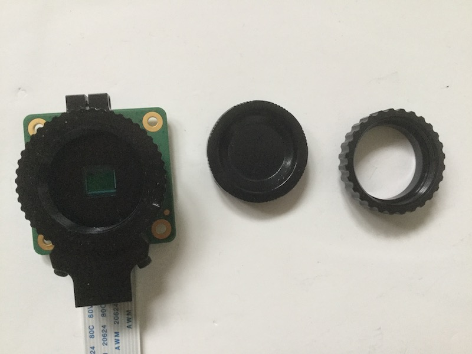
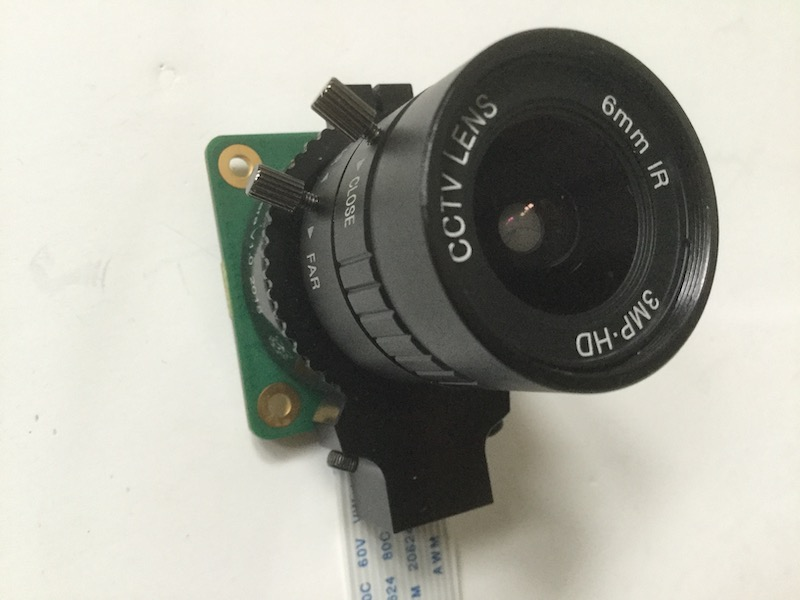

## Kit Assembly

In this step we are going to build a real Astro Pi using the official kit you received from ESA. We understand that building your Astro Pi can be intimidating, which is why we have created the checklist below for you to follow! But before starting the assembly, let's familiarise ourselves with what's in the box...

--- collapse ---
---
title: What's in the box?
---
It may be small but your kit box really packs a punch! Your official Astro Pi kit includes:

| 1x [Raspberry Pi 4](https://www.raspberrypi.com/products/raspberry-pi-4-model-b/) 4GB | 1x Power Supply Unit | 1x 16GB Micro SD card | 1x HDMI cable |
|:--------:|:-------:|:--------:|:--------:|
| {:width="250px" :height="150px"} |  |  |  |

| 1x Sense HAT (V2) | 1x Tall header pins | 
|:--------:|:-------:|
|  |  |

TODO tall header pins are only if there is a PIR sensor
TODO add the spacers and the regular headers?

If your experiment uses the camera, you will also have:

| 1x HQ Camera Module | 1x 6mm Camera Lense |
|:--------:|:-------:|
|  |  |

and if you will be using infra-red photography, your kit will also include:

| 1x red optical filter | 1x allen key (1.5mm) |
|:--------:|:-------:|
|  |  |

If your experiment detects movement or involves machine-learning at runtime, you may also have some of the following in your box:

| A passive infrared (PIR) motion sensor | 3x female-female jumper wires | A [Coral USB Accelerator](https://coral.ai/products/accelerator) | 1x USB-C to USB-A cable |
|:--------:|:-------:|:--------:|:--------:|
|  |  |  |  |

If you want to, you can [make a 3D-printed flight case](https://projects.raspberrypi.org/en/projects/astro-pi-flight-case-mk2){:target="_blank"}, and use this to even more closely simulate the ISS environment for more realistic testing. However, you don't need one to take part in Mission Space Lab. 

--- /collapse ---

## Method

Before getting started, familiarise yourself with what's in the box and unpack everything. Make a note of whether your box includes the camera module, a Coral TPU dongle, or a PIR motion sensor using the checkboxes below. This will show or hide the relevant assembly instructions accordingly.

- My box contains a camera <input type="checkbox" id="hasCamera">

  - My box contains an infrared sensor <input type="checkbox" id="hasInfrared">

- My box contains a PIR sensor <input type="checkbox" id="hasPir">
- My box contains a Coral dongle <input type="checkbox" id="hasCoral">

--- task --- 
Place the Raspberry Pi 4 on a flat surface, end make sure it is turned off
with nothing plugged in.
--- /task ---

### Attaching the Sense Hat

We are going to start by assembling the Sense HAT.

--- task ---
Find the Sense HAT and the small bag that comes with it that includes some screws and spacers, as well as a regular GPIO header.
Remove the small circular sticker on the top of the Sense HAT if it's on there.

--- /task ---

--- task ---
Take the black hexagonal spacer columns from the small bag that comes with the Sense HAT. Use the accompanying screws to connect them to the bottom of the Raspberry Pi 4.

--- /task ---

--- task ---
In a separate bag, locate the tall GPIO header. We will use this header instead of the regular header to allow enough space for the PIR sensor.
--- /task ---

--- task ---
Line up the header with the corresponding holes on the bottom of the Sense HAT.  

--- /task ---

--- task ---
Push the 
tall
 header all the way through, making sure none of the pins are obstructed and that they are lined up correctly so that they do not become bent.  

--- /task ---

--- task ---
With the Raspberry Pi High Quality Cable and connector cable unboxed, take the connector cable and feed it through the gap in the Sense HAT. The silver side of the connector cable should face the LED matrix and not the blue side.
TODO photo needed...
--- /task ---

--- task ---
Find the CSI (Camera Serial Interface) port on the Raspberry Pi and gently pull the edges of the port's plastic cap.

--- /task ---

--- task ---

Insert the camera ribbon cable into the Raspberry Pi CSI socket, making sure the connectors at the bottom of the ribbon cable are facing the contacts in the port. There should be 1 or 2mm of silver still remaining when the cable has been put in corectly.
Then, push the plastic clip back into place.

--- /task ---

--- task ---
Place the Sense HAT onto the Raspberry Pi and line up the 40 GPIO pins line up with the corresponding holes in the header.   

<iframe width="560" height="315" src="https://www.youtube.com/embed/VzYGDq0D1mw" frameborder="0" allow="accelerometer; autoplay; encrypted-media; gyroscope; picture-in-picture" allowfullscreen></iframe>

 

TODO this photo is not applicable to everyone now because it has a camera - change

--- /task ---

--- task ---
Use the four remaining black screws to secure the Sense HAT stack to the spacers. 

--- /task ---

### PIR Motion sensor

--- task ---
Take the PIR and remove the foam pin protector block. 

--- /task ---

--- task ---
Take a moment to familiarise yourself with the layout of the Raspberry Pi pins [here](https://pinout.xyz). There are a lot of different types of pins but the diagram is actually not too hard to navigate: notice that the odd-numbered pins are on the left, the even-numbered pins are on the right, and that the pin number increases by 2 each time we go down a row. 

Similarly, take a moment to look at the PIR sensor. Do you see the labels GND, VCC, and OUT?

--- /task ---

--- task ---
Now we are going to connect each pin on the PIR sensor to an appropriate pin on the Raspberry Pi using the three female-female jumper wires provided in the kit. Don't worry if you make a mistake - as long as you don't switch the power on you can try again any time!

- Connect the VCC pin on the PIR sensor to pin 1 (3V3) on the Raspberry Pi
- Connect the GND pin on the PIR sensor to pin 6 (GND) on the Raspberry Pi
- Connect the OUT pin should be connected to pin 32 (GPIO 12)

**Note**: Your jumper wires may be a different colour to the ones in the photos - the colour doesn't matter, don't worry!

--- /task ---

### Setting up the Coral Machine Learning accelerator

--- task ---

Good news - the Coral dongle requires no assembly! 
Simply locate the USB-C cable and plug it into the dongle, and then plug the other end into any of the blue USB (USB 3) ports.

TODO: add photo
--- /task ---

### Converting the camera to use infrared

If your Life on Earth experiment requires an infrared-sensitive (IR-sensitive) camera - for example, you are doing a NDVI (Normalized Difference Vegetation Index) experiment - then you will need to convert your camera using the steps below.

**Note**: If you are programming a Life in Space experiment, or your Life on Earth experiment requires photos to be taken in the visible light spectrum only, then please don't convert your high-quality camera sensor as you can't reverse/undo it later!

--- collapse ---
---
title: How does it work?
---
The high-quality camera sensor can detect infrared (IR) light. However, the sensor housing contains an IR filter, which is used to greatly reduce the camera’s sensitivity to IR light.  This is so that the images captured by the high-quality camera sensor look the same as what we see with our eyes (which are not sensitive to IR light). By removing this filter we allow the IR light to pass through along with visible light.

In the next steps we will replace the built-in filter with a separate red filter which allows only reflected red light (660nm) and reflected near-infrared light (850nm) through to the sensor.  See our [NDVI (Normalized Difference Vegetation Index) project](https://projects.raspberrypi.org/en/projects/astropi-ndvi) for more information. 

--- /collapse ---

--- task ---
Remove the built-in infrared filter from the high-quality camera by following the [instructions here](https://www.raspberrypi.org/documentation/accessories/camera.html#raspberry-pi-hq-camera-filter-removal).
--- /task ---

--- task ---
 
Make sure the back focus ring is screwed all the way in. 

--- /task ---

--- task ---
 
Unscrew the high-quality camera sensor lens cap and the C/CS adapter. 

--- /task ---

--- task ---
 
Take the filter and sit it onto the hole in the centre of the high-quality camera sensor. 

--- /task ---

--- task ---
 
Gently start turning the filter clockwise using just your fingers, so that the filter screws down into the high-quality camera sensor. Take care not to touch the glass part of the lens and leave greasy fingerprints!

--- /task ---

--- task ---
 
Take the tool provided with the filter and line up the two knobbly bits at each end with the corresponding dimples in the filter. If you have a 3D printer, you might like to print a handle for the tool to make it easier to grip. One of these handles has been printed and sent to the ISS for the astronauts to use when completing the task — but it isn't required. 

--- /task ---

--- task ---
 
Continue gently turning the filter using the tool. Take care not to touch the glass part of the lens with the tool — it will scratch it!

--- /task ---

--- task ---
 
You should start to feel increasing resistance as the filter gets lower. After about nine full turns, the filter should be as low as it can go and you won't be able to turn it any further. Be careful not to over-tighten. 

--- /task ---

### Finishing the camera assembly

--- task ---
Remove the caps from the narrower end of the 6mm lens 

TODO need a photo
--- /task ---

--- task ---
Remove the protective cap from the high-quality camera sensor. 

--- /task ---

--- task ---
Remove the C/CS adapter ring from the high-quality camera sensor. 

--- /task ---

--- task ---
Screw the 6mm lens onto the high-quality camera sensor. 

--- /task ---

### Final assembly steps

Finish your Astro Pi with these steps!

--- task ---
Connect your keyboard and mouse into the two (black) USB-2 ports.
--- /task ---

--- task ---
Connect the little micro-HDMI cable into the HDMI 1 port of the Raspberry Pi
and connect the other end into whatever screen you will be using.
--- /task ---

--- task ---
The SD card comes in a large adapter, so remove it from the adapter and insert it into the SD port on the bottom of the Raspberry Pi - make sure you put it in the right way!
--- /task ---

--- task ---
Finally, connect the USB-C power cable into the Raspberry Pi and watch it boot up!
Lift off!
--- /task ---

Congratulations, you have made an Astro Pi! 🚀

## Videos

TODO find out where to put the videos

