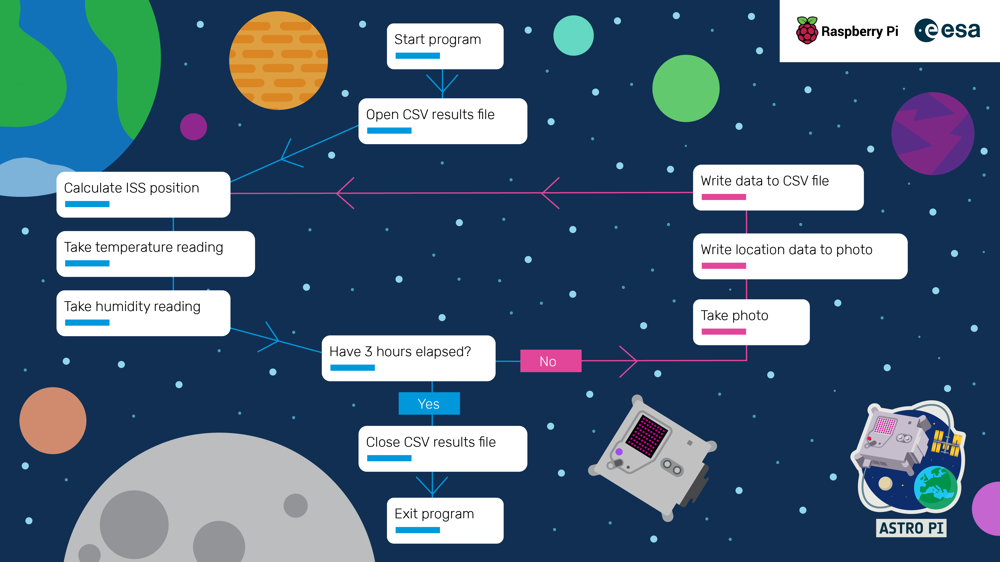
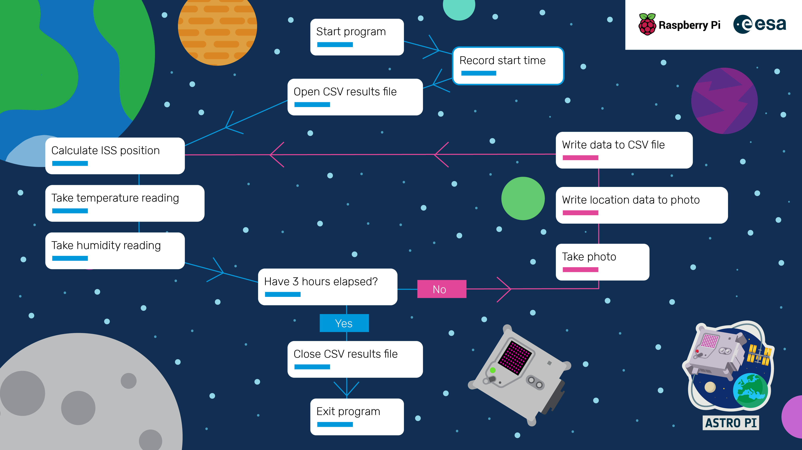

## Planning Your Work

Teams have often reflected in previous years that they wished they had spent more time in the planning and design stages of their experiment. Being organised should make the most of the opportunity to run your code aboard the ISS, and in this section we've put together some team activities for you to try. Before you start, though, check out this video from last year:

<iframe width="560" height="315" src="https://www.youtube.com/embed/owcZeUnSixM" frameborder="0" allow="accelerometer; autoplay; encrypted-media; gyroscope; picture-in-picture" allowfullscreen></iframe>

### 5 questions to get started

To get started planning your Phase 2, you could meet together as a team and try and answer the questions below. This should help you decide how you are going to work together and set some expectations. Make sure everyone gets a turn to speak.

- _How are you going to make decisions as a team?_ Will you all have a say, or will you elect someone to take charge?
- _How can you utilise everyone's strengths?_ What is everyone good at, and how can you help each other?
- _What does everyone want to learn?_ Don't just do what you're good at - try something new!
- _How much time you do you have?_ Decide when and where you will meet, and how often.
- _How will you work together?_ Will you work online or mostly in person?

### Timeline

As a team, decide on the ideal date you would like to finish writing your program. Make sure you have enough time to test it fully before submitting it, and to check it against the [requirements checklist](https://astro-pi.org/mission-space-lab/guidelines/program-checklist).

### Identify your measurements

Once you have answered the 5 questions above and created a rough timeline for your work, the next step is to note down the measurements and data you will need to test your hypothesis. If you need help with this, take a look at [this project](https://projects.raspberrypi.org/en/projects/experiment-design) and in particular the [define your measurements](https://projects.raspberrypi.org/en/projects/experiment-design/2) page. 

This step will really help you to make sure the outputs of your program are useful for later stages of MSL, and that you remain focused throughout stage 2!

--- collapse ---
---
title: Limitations of the sensors
---

Be aware of the limitations of the sensors and their constraints. In particular, be mindful that the temperature and humidity sensors are affected more by the temperature of the CPU than anything else. If you would like to take readings of the ISS environment, it's advisable that you test the temperature and humidity readings in a controlled (known) environment and come up with a strategy to compensate for this limitation.

---/collapse ---

### Do some research

There are lots of resources on how to use the Astro Pi hardware on the [projects.raspberrypi.org](https://projects.raspberrypi.org) website. To make the most of your opportunity we recommend you complete either of the pathways below, depending on the nature of your experiment:

- [Life in Space pathway](https://projects.raspberrypi.org/en/pathways/life-in-space)
- [Life on Earth pathway](https://projects.raspberrypi.org/en/pathways/life-on-earth)

--- task ---
Pick a project pathway to look at and create a plan to study it as a team
--- /task ---

You don't need to just restrict yourself to the projects site though! You could use a search engine to try and find examples of other teams working on a similar idea, to find more data for a machine learning experiment, or to engage with real scientific literature.

Check out the [Resources section](11) for more inspiration.

### Work out the key program tasks visually
Once you have a good idea of what you are trying to achieve with your program, the next step is to work out the tasks that the program will need to do. We recommend doing this visually using pen and paper, or a whiteboard, or online using a tool like [Miro](https://miro.com).

--- task ---
List all of the key tasks that your program will need to perform. You don’t need to worry about the order or the actual functions and commands at this stage — just note down the specific things that need to be achieved like in the image below.
--- /task ---

--- task ---
Have a closer look at each task and think about whether it can be split into smaller subtasks. Check to see if there are any actions that can be combined with one another, or if there are any tasks that need to be repeated.
--- /task ---

--- task ---
Try to put everything into a logical order, using lines to connect the various tasks. It will start to get messy, but you will probably discover that there are some obvious repeated tasks - these tasks are probably going to be written as functions that you will reuse.
--- /task ---

If you have been using a whiteboard or pen and paper, don't forget to take a photo of your work to save it for later!

### Draw a flow chart

Using your notes from the previous step, try and refine the tasks into a [flow chart](https://simple.wikipedia.org/wiki/Flow_chart), which is a diagram of all of a program’s tasks, in the right order, but doesn’t contain any actual programming language commands. To do this you can follow these steps:

- Identify the natural order of the tasks and try and use arrows to connect them in a sequence to create a 'flow' along the page, zig-zagging a bit like a [snakes and ladders board](https://upload.wikimedia.org/wikipedia/en/b/ba/Cnl03.jpg).
- Identify any decisions that the program needs to make and check that all outcomes are catered for.
- Include a ‘start’ and ‘end’ block to make it very clear where the program begins and finishes.

A flow chart for a typical experiment might look something like this:

### Consider 'What if' scenarios

An important aspect of programming and design is making sure you are ready for when things go wrong. Most experiments will have a main loop that runs repeatedly over the 3-hour period. An unexpected error encountered in this loop could be disastrous if it causes the program to stop or stall and prevent further data collection. So, think of some ‘what if’ scenarios. For example, if you’re reading data from a sensor, what will happen if it gives you an unexpected result? Will your program cope with this? How are you dealing with hardware errors? 

--- task ---
Identify points in your flowchart where errors might occur and add new blocks to cater for them.
--- /task ---

### Assign tasks to members of the team

After finishing your flowchart it is a good idea to review it altogether and double check that there is no unnecessary work and that you're satisfied that the final result will help you test your hypothesis. Once you're satisfied, assign tasks by following the steps below.

+ Give descriptive names to each task block.
+ Assign responsibility for each block to different members of the team, keeping in mind their experience and desires.
+ Remember that someone needs to be responsible for the scaffold of the final program that will contain the various function calls in the right order.

You may want to use a project management tool to keep track of your tasks. Something as simple as [Google Keep](https://www.google.com/keep/) could work, or you could use a [Trello](https://www.trello.com) or [Monday.com](https://www.monday.com) board. 

Whatever method you choose to track your work, make sure to schedule a time to meet regularly to discuss progress and work through any major challenges as a group. It can be useful to update your pseudocode flow diagram to reflect any changes that your team realise are necessary as they write the actual program!

## Get coding!

Now that you have a much better idea of what your experiment program is going to do, it's time to get coding! Continue reading for specific guidance on how to write your program.

