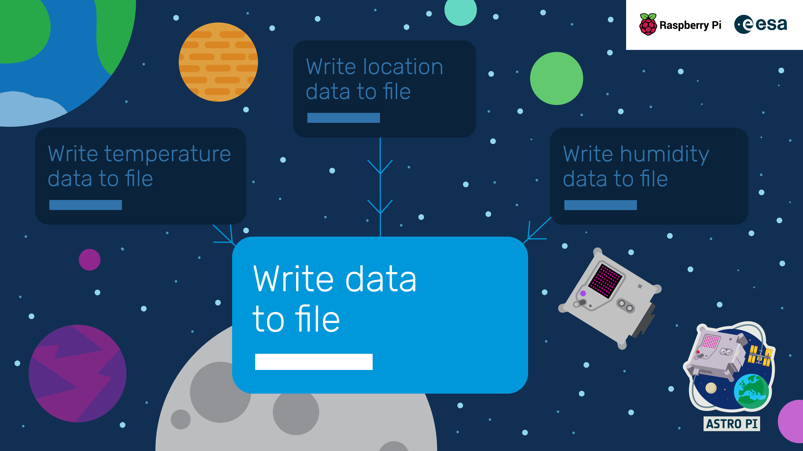
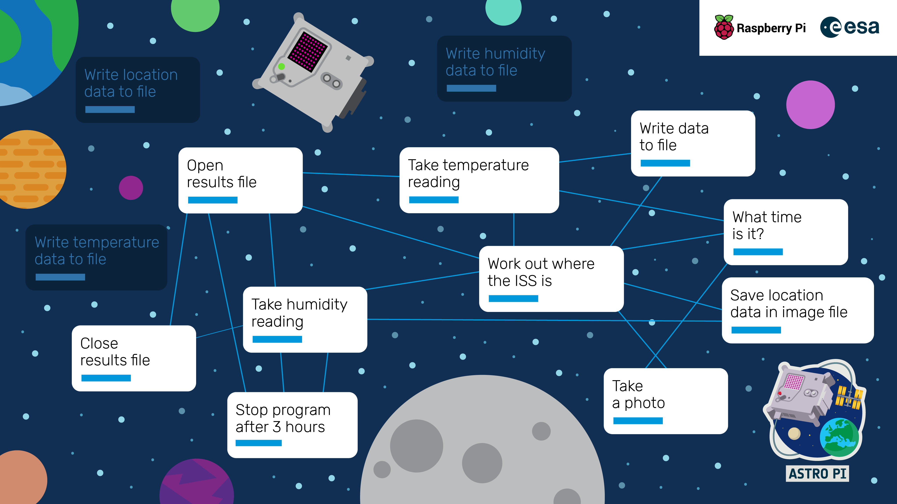

## Planning Your Work

To help with planning, we've put together some useful tips for Phase 2 that will facilitate your team's coding.

### How to approach writing the program for Phase 2 of Mission Space Lab

+ Read through this guide. Familiarise yourself with the requirements that your program must meet so that it can advance to the next phase and run smoothly on the Astro Pis on the ISS. Read the useful tips provided throughout on how to best to develop your program and make the most of your experimental results.

### Work out the key tasks

+ Get your team together and start to map out the rough outline of how your program will work. You could do this as a group and have everyone call out their ideas, or all team members could work individually and then get together to compare results.

+ Use a whiteboard or big sheet of paper to list all of the key tasks that your program will need to perform. You don’t need to worry about the order or the actual functions and commands at this stage — just note down the specific things that need to be achieved. This is what that would look like for the example scenario above:

+ Have a closer look at each task and think about whether it can be split into smaller subtasks. Moreover, are there any actions that can be sensibly combined with one another? Also, see if there are any tasks that need to be repeated.

+ Try to put everything into a logical order, using lines to connect the various tasks. It will start to get messy, but that’s good! You will probably discover that there are some obvious repeated tasks. This is a good time to introduce or reinforce the programming concepts of repetition and loops.

+ If there are any repeated tasks, do they appear just once in your diagram, with flow lines passing through many times, or do they fit in in multiple places? Talk with your team about how repeated tasks should only be coded once, so that parts of the program can be reused.

### Create a flow chart

+ Take a fresh sheet of paper or find a clean area on your whiteboard (be sure to copy or take a photo of your first picture before you erase anything). Reconfigure the steps and flow into a more ordered diagram, maybe running clockwise around the paper or starting at the top and working downwards. Try a few different versions and see which one is the easiest to follow. Include a ‘start’ and ‘end’ block to make it very clear where the program begins and finishes. Are there any actions that you need to perform at these stages? The final result is what is called a flow chart: a diagram of all of a program’s tasks, in the right order, but doesn’t contain any actual programming language commands.

+ Work through your task list and try to identify any missing pieces. Add any missing functionality into your flow chart.

+ You should also think about where in your program you should be looking to handle exceptions and errors. Most experiments will have a main loop that runs repeatedly over the 3-hour period. An unexpected error encountered in this loop could be disastrous if it causes the program to stop or stall and prevent further data collection. So, think of some ‘what if’ scenarios. For example, if you’re reading data from a sensor, what will happen if it gives you an unexpected result? Will your program cope with this? How are you dealing with hardware errors?

### Assign tasks to members of the team

+ Give descriptive names to each task block.

+ Assign responsibility for each block to different members of the team. Try to think about the individual team members’ experience levels and programming ability and allocate tasks accordingly. Depending on the number of people in your team and the complexity of your program, it may be sensible to have more than one person allocated to a specific block or function.

+ Remember that someone needs to be responsible for the scaffold of the final program that will contain the various function calls in the right order.

### Get coding!

+ You will probably discover that some functions are really easy to create using the recommended Python libraries, perhaps even with only a single line. Others will be more complex, and we have included some useful code snippets in the coding requirements document (e.g. for adding latitude and longitude information to the EXIF data of a photo) that you can copy into your project. To design more complicated functions, if needed, you can use the same pseudocode approach that you used with the program as a whole.

+ Remind your team that they cannot install additional Python libraries or access the internet on the Astro Pi computers aboard the ISS, so they should not use any commands that make a web request or look up something from an online source.

+ Encourage each team member or subteam responsible for a specific part of the program to code their section so that it works by itself, just like the examples in the coding requirements document. Suggest that they add comments and docstrings as they go along.

+ Get together regularly to discuss progress and work through any major challenges as a group. It is useful to update your pseudocode flow diagram to reflect any changes that your team realise are necessary as they write the actual program.

+ Keep the deadline for submitting your program in mind. If time is running out, are there any parts of your program that can be left out? If you are planning on performing analysis of results in real time, can this instead be done after your program has run, when you’ve got your results back?

### Test your program

+ Don’t forget to test your program in the Desktop version of the Flight OS: open a terminal, type `python3 main.py` and make sure your program terminates after 3 hours without generating any errors (including any exceptions that may have been caught and recorded in the log). 
+ Check that the data and images captured by your program match what you would expect. 
+ Make sure you go through the requirements checklist in the last step of this guide. 

